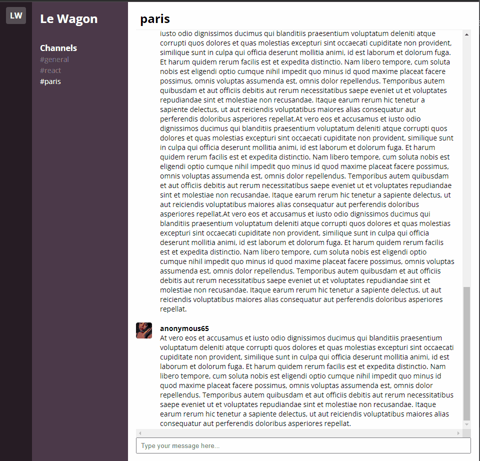

### Chat Redux

The goal of this challenge was to create a React clone of the Slack messaging app.
The app uses Redux to store the app state.

Here's how it looks:

#### 1. Setup

The challenge used the Le Wagon [Redux boilerplate](https://github.com/lewagon/redux-boilerplate):

#### 2. Features

* Users can enter a username upon launching the app.
* Users can select from a list of chat channels.
* Users can see a history of messages for a selected channel called from an API.
* Users can post messages to a selected channel via an API.

#### 3. Potential

* Allow users to create channels.
* Allow users to direct message each other.
